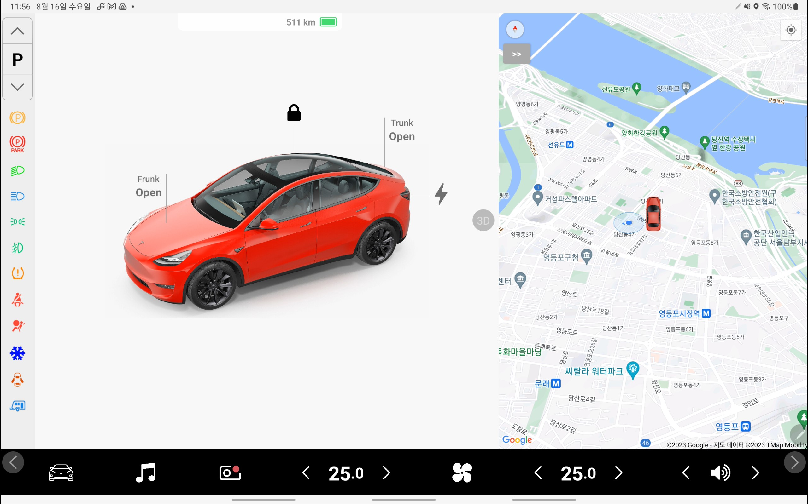

# 1. CarPlug Overview
Solution for implementing Tesla clone (Tesla-style Touchscreen UI)
- **Android**(not Android Automotive) and **React Native** for developing high-integrity UI

- **Node.js** signal server/gateway for interconnecting **Legacy CAN** Domains and IP-based **High-Performance Computers**

# 2. Target Audience
- OEM: trying to catch up with Tesla Touchscreen UI (Media Controller)
- Tier-1: offering advanced but universal/single/own-branded infotainment system to several global OEMs
- Google or Apple integrating vehicle interfaces to its mobile OS (Android or iOS)

# 3. Demo

## 1) screenshots
- Car Control [car control pictures](demo/screenshots/01_Dashboard_CarControl/car_control.md)
- Media: Radio, Netflix, YouTube, ... [media pictures](demo/screenshots/02_Dashboard_Media/media.md)
- Navigation: coming soon
- Climate: coming soon
- Camera: coming soon
## 2) videos (Screen recording)
- Car Control
- Media: Radio, Netflix, YouTube, ...
- Navigation: coming soon
- Climate: coming soon
- Camera: coming soon

# 4. Architecture: Building Blocks

## 1) dashboard (Tesla-style touchscreen UI, main HMI)
**Android**(not Android Automotive) and **React Native** based touchscreen infotainment UI

## 2) signal server
**Node.js** signal server/gateway for interconnecting **Legacy CAN** Domains and IP-based **High-Performance Computers**

## 3) phone app (TBD)

## 4) vehicle simulation (TBD)

## 5) dashboard desktop version (development purpose only)
For people who don't have any Android tablet.

## 6) signal viewer (development purpose only)
CAN signal viewer

# 5. Benefits
## 1) Why not Android Automotive but "pure" Android?
- Well-established mobile Apps can be reused without any change

  Third-party navigation and map: Google, Baidu, and Korean maps (Kakao, T-Map)

  Music streaming: Spotify, YouTube Music, ...

  OTT: Netflix, YouTube, ...
- ICT industry's tons of developers ready to join auto industry only if vehicle signals are visible to them. Where Signal Server/Gateway is needed.

  Are they willing to learn Android Automotive? Not very likely.
## 2) React Native
- Easy Javascript programming language
- Largest Javascript developer pool
- Huge "React Native" developer community
- Performance not lost by utilizing Native module programming if necessary
## 3) Node.js
- Several protocols processed by a single Node.js server: HTTP, WebSocket, UDP, WebRTC
- Thousands of CAN signals distributed efficiently to Apps residing on HPC and vice versa
- Set, Get, Subscribe/Unsubscribe supported

# 6. Build and Run
## 0) Install Node.js on your computer
## 1) Vehicle signal server
- download 'car-plug-server'
- install node modules [console]: npm install
- run the app [console]: npm start gw
## 2) Dashboard (main HMI)
- download 'dashboard/VirtualDashboard-debug.apk' (zipped)
- unzip and install it on your Android tablet. Continue installation even though some security warnings show up.
- run it
## 3) Dashboard desktop version (main HMI)
- download 'dashboard-proxy-server'
- install node modules [console]: npm install
- run the app [console]: node src/index
- download 'dashboard-client'
- generate your Google Map API key and fill it in the '.env' file
- install 'serve' module [console]: npm install -g serve
- run the app [console]: serve -s
- open browser (chrome) and type: localhost:3000
## 4) Signal viewer (optional)
- download 'car-plug-viewer'
- install 'serve' module [console]: npm install -g serve
- run the app [console]: serve -s
- open browser (chrome) and type: localhost:3000 
