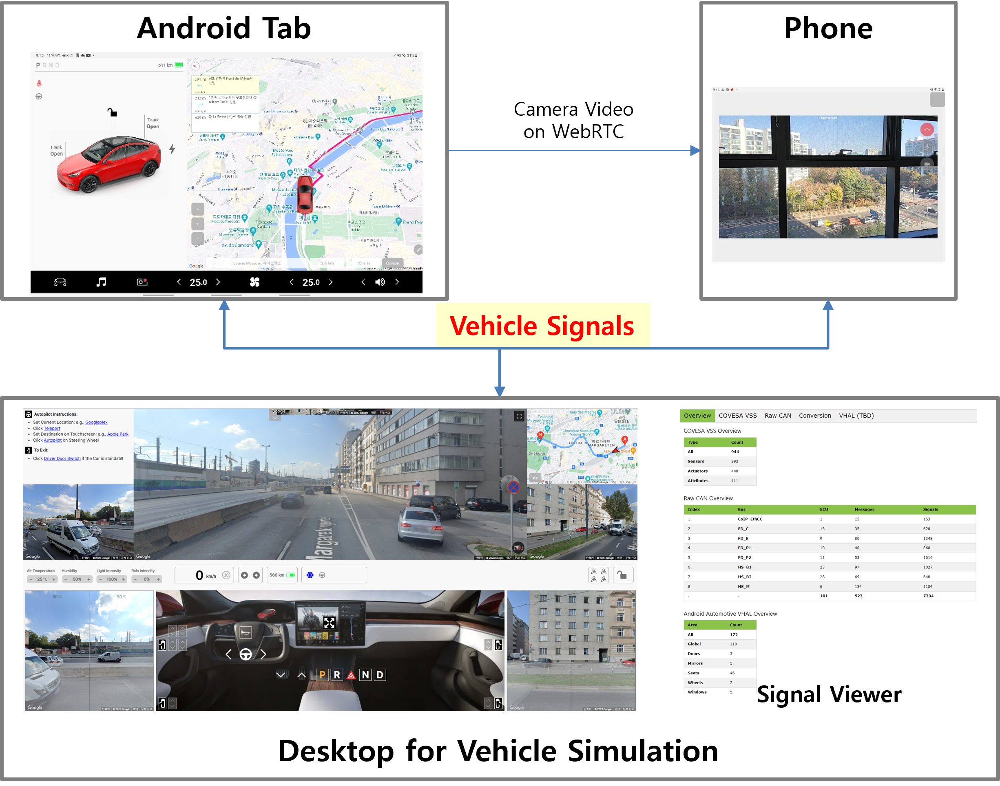
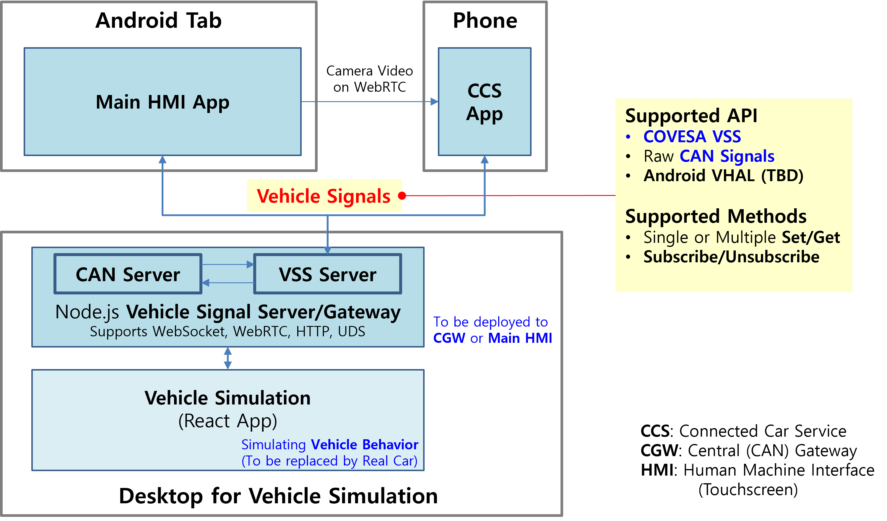

# 1. CarPlug Overview
Solution for implementing Tesla clone (Tesla-style Touchscreen UI)
- **Android**(not Android Automotive) and **React Native** for developing high-integrity UI

- **Node.js** signal server/gateway for interconnecting **Legacy CAN** Domains and IP-based **High-Performance Computers**

# 2. Target Audience
- OEM: trying to catch up with Tesla Touchscreen UI (Media Controller)
- Tier-1: offering advanced but universal/single/own-branded infotainment system to several global OEMs
- Google or Apple integrating vehicle interfaces to its mobile OS (Android or iOS)

# 3. Demo Screenshots

## 1) Screenshots
- Car Control [car control pictures](demo/screenshots/01_Dashboard_CarControl/car_control.md)
- Media: Radio, Netflix, YouTube, ... [media pictures](demo/screenshots/02_Dashboard_Media/media.md)
- Navigation [navigation pictures](demo/screenshots/03_Dashboard_Navigation/navigation.md)
- Climate [climate pictures](demo/screenshots/04_Dashboard_Climate/climate.md)
- Camera: coming soon
## 2) Videos (Screen recording)
- Car Control
- Media: Radio, Netflix, YouTube, ...
- Navigation: Third-party map (Kakao, Google), Simulated Driving (Google map)
- Climate Control
- Camera

# 4. Architecture: Building Blocks

## 1) Touchscreen (Tesla-style touchscreen UI, main HMI)
**Android**(not Android Automotive) and **React Native** based touchscreen infotainment UI

## 2) Signal Server
**Node.js** signal server/gateway for interconnecting **Legacy CAN** Domains and IP-based **High-Performance Computers**

## 3) Vehicle Simulator
**React** app simulating vehicle behavior and status

## 4) Signal Viewer (development purpose only)
Signal viewer: CAN and VSS

## 5) Phone App (TBD)

# 5. Benefits
## 1) Why not Android Automotive but "pure" Android?
- Well-established mobile Apps can be reused without any change

  Third-party navigation and map: Google, Baidu, and Korean maps (Kakao, T-Map)

  Music streaming: Spotify, YouTube Music, ...

  OTT: Netflix, YouTube, ...
- ICT industry's tons of developers ready to join auto industry only if vehicle signals are visible to them. Where Signal Server/Gateway is needed.

  Are they willing to learn Android Automotive? Not very likely.
## 2) React Native
- Easy Javascript programming language
- Largest Javascript developer pool
- Huge "React Native" developer community
- Performance not lost by utilizing Native module programming if necessary
## 3) Node.js
- Several protocols processed by a single Node.js server: HTTP, WebSocket, UDP, WebRTC
- Thousands of CAN signals distributed efficiently to Apps residing on HPC and vice versa
- Set, Get, Subscribe/Unsubscribe supported

# 6. Set-up and Run
## 1) Download all the executable packages
- car-plug-server
- vehicle-simulator
- car-plug-viewer
- touchscreen
- run.bat
## 2) Run the Signal Server, Vehicle Simulator, and Signal Viewer
- Execute 'run.bat' [console]: ./run.bat
- For OS other than Windows (linux or mac OS), corresponding batch scripts can be written.
  For Linux, please refer to "run-linux.sh".
## 4) Run the Touchscreen (main HMI)
- Unzip 'touchscreen/VirtualDashboard-release.zip'.
- Install the APK on your Android tablet. Continue installation even though some security warnings show up.
- Run the app.
