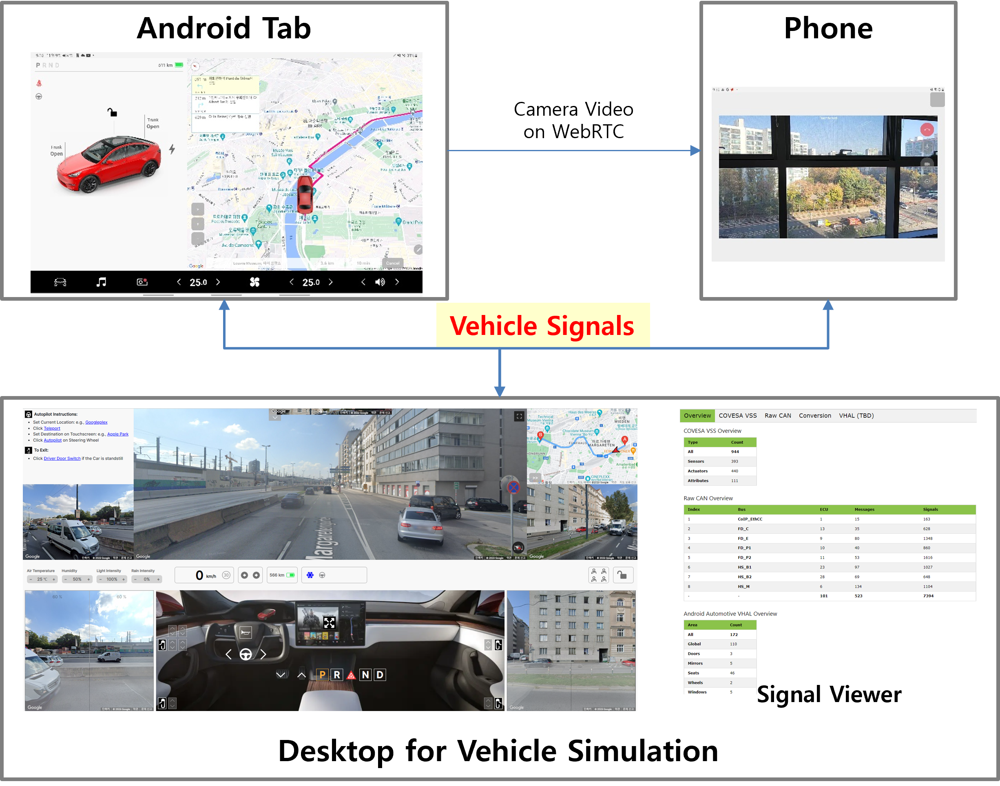
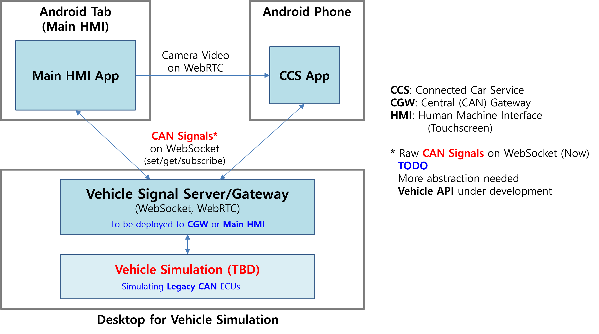

# 1. CarPlug Overview
Solution for implementing Tesla clone (Tesla-style Touchscreen UI)
- **Android**(not Android Automotive) and **React Native** for developing high-integrity UI
- **Node.js** signal server/gateway for exchanging **Vehicle Control Signals** with **Touchscreen HMI**

# 2. Demo Screenshots

## 1) Screenshots
- Car Control [car control pictures](demo/screenshots/01_Dashboard_CarControl/car_control.md)
- Media: Radio, Netflix, YouTube, ... [media pictures](demo/screenshots/02_Dashboard_Media/media.md)
- Navigation [navigation pictures](demo/screenshots/03_Dashboard_Navigation/navigation.md)
- Climate [climate pictures](demo/screenshots/04_Dashboard_Climate/climate.md)
- Camera: coming soon
## 2) Videos (Screen recording)
- Car Control
- Media: Radio, Netflix, YouTube, ...
- Navigation: Third-party map (Kakao, Google), Simulated Driving (Google map)
- Climate Control
- Camera

# 3. Architecture: Building Blocks

## 1) Touchscreen (Tesla-style touchscreen UI, main HMI)
**Android**(not Android Automotive) and **React Native** based touchscreen infotainment UI

## 2) Signal Server
**Node.js** signal server/gateway for exchanging **Vehicle Control Signals** with **Touchscreen HMI**

## 3) Zone Monitor embedding Vehicle Simulator
- **Zone Monitor** app for monitoring Vehicle Zones
- **Vehicle Simulator** app simulating vehicle behavior and status
- **Touchscreen** app (React App) is also included.

# 4. Set-up and Run
## 1) Clone at least the following apps.
- car-plug-server
- car-plug-monitor
- launcher
## 2) Install Node.js modules: execute "npm install" where,
- car-plug-server
- car-plug-monitor
## 3) Put your Google Map API Key into "car-plug-monitor/.env" file where,
- REACT_APP_GOOGLE_MAP_API_KEY="Enter Your Google Map API Key"
## 4) Launch the apps by executing the batch file in "launcher" folder.
- For Windows, execute 'run_car_plug.bat'.
- For Linux, to be defined.
## 5) (Optional) Run the Touchscreen (main HMI)
- Unzip 'touchscreen/VirtualDashboard-release.zip'.
- Install the APK on your Android tablet. Continue installation even though some security warnings show up.
- Run the app.
