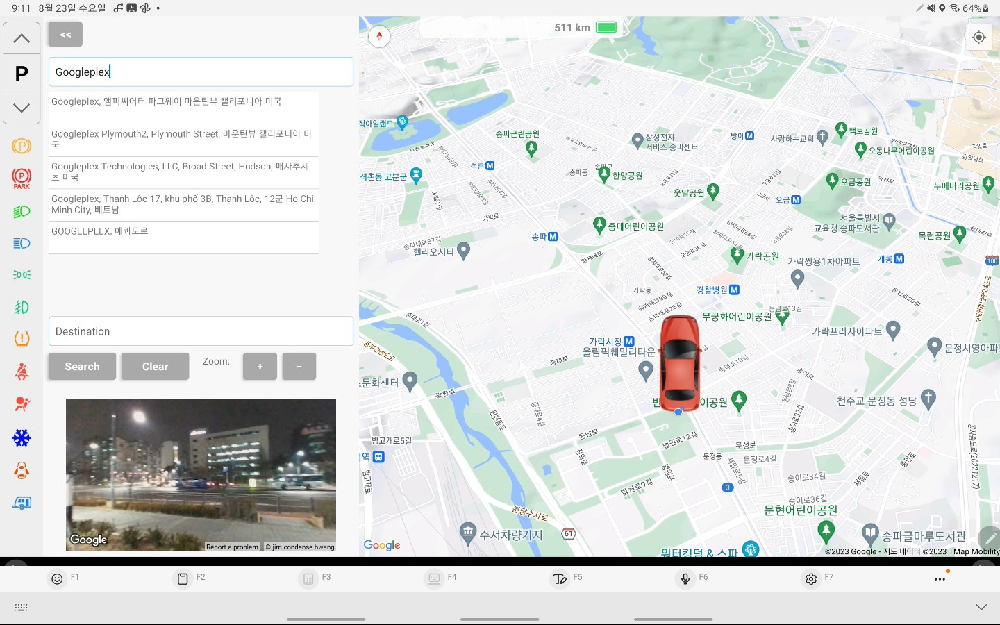
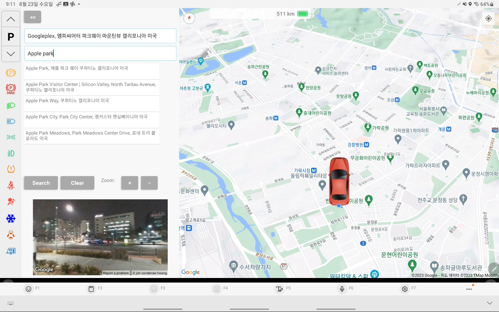

* The same third-party maps from tech companies that phone users are familiar with can be reused without any change.

- Third-party map: Kakao
  

- Third-party map: Google
  

- Simulated Driving: Set origin
  

- Simulated Driving: Set destination
  

- Simulated Driving: Search route
  

- Simulated Driving: Driving
  
